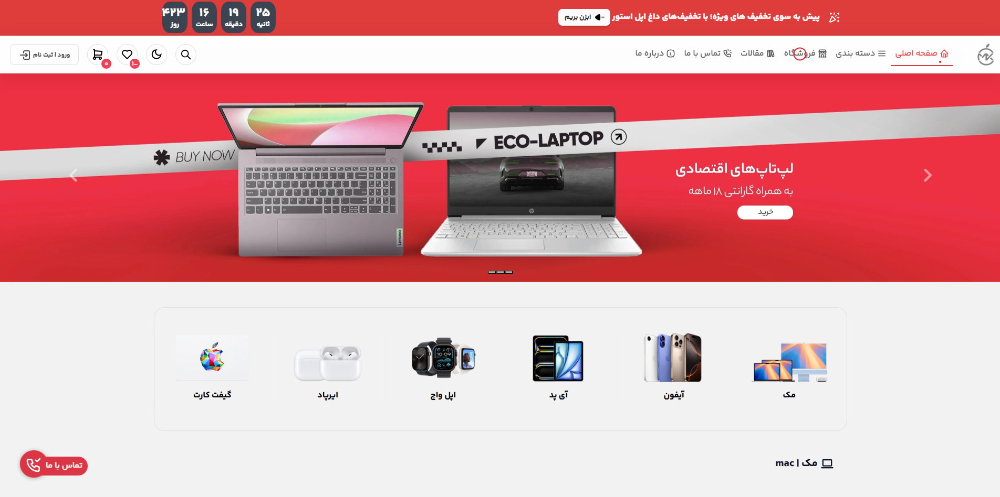

# Shopping Angular — Apple Store (Angular 17)



**Shopping Angular** is a lightweight e-commerce storefront built with Angular 17 and Material/Bootstrap UI (MDB). The project demonstrates a modern single-page shopping interface — product listing, product details, cart, and a polished UI inspired by the Apple store. 

---

## Features
- Clean, responsive product listing and detail pages  
- Add to cart and simple cart management UI  
- Search and category filtering
- Built using Angular (TypeScript) and MDB / Bootstrap components  
- Meant as a starter/demo app for learning Angular frontend patterns

---

## Tech stack
- **Framework:** Angular 17 (TypeScript)  
- **UI:** Material Design for Bootstrap (MDB) / Bootstrap 5  
- **Package manager:** npm (or your preferred yarn/pnpm)  
- **Extras:** example assets and UI kit included in the repo. :contentReference[oaicite:2]{index=2}

---

## Prerequisites
Make sure you have the following installed:
- Node.js (LTS recommended, e.g. Node 18+)
- npm (comes with Node) or yarn/pnpm
- (Optional) Angular CLI for local development: `npm install -g @angular/cli`

---

## Quick start (local)
1. Clone the repository  
   ```bash
   git clone https://github.com/thisalireza/shopping-angular.git
   cd shopping-angular
